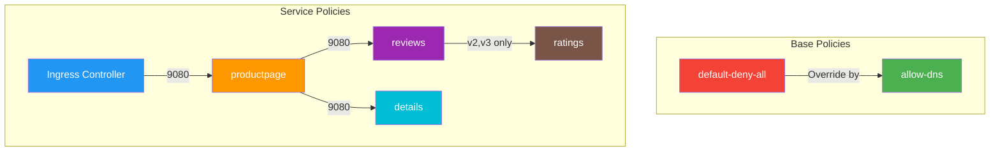

# Bookinfo Network Policies

This directory contains Calico Network Policies for the Bookinfo application, implementing a zero-trust security model.

## Directory Structure

```
.
├── base/
│   ├── 00-default-deny.yaml    # Default deny all traffic
│   └── 01-allow-dns.yaml       # Allow DNS resolution
└── services/
    ├── productpage/
    │   ├── ingress.yaml        # Allow traffic from ingress-nginx
    │   └── egress.yaml         # Allow traffic to reviews and details
    ├── reviews/
    │   ├── ingress.yaml        # Allow traffic from productpage
    │   └── egress.yaml         # Allow v2/v3 traffic to ratings
    ├── details/
    │   └── ingress.yaml        # Allow traffic from productpage
    └── ratings/
        └── ingress.yaml        # Allow traffic from reviews v2/v3
```

## Policy Overview



## Policy Details

### Base Policies
- **default-deny-all**: Implements zero-trust model by denying all traffic by default
- **allow-dns**: Enables DNS resolution for all pods

### Service-specific Policies

#### Productpage Service
- **Ingress**: Allows traffic from ingress-nginx controller
- **Egress**: Permits connections to reviews and details services

#### Reviews Service
- **Ingress**: Accepts traffic from productpage
- **Egress**: Allows v2/v3 versions to connect to ratings service

#### Details Service
- **Ingress**: Accepts traffic from productpage only

#### Ratings Service
- **Ingress**: Accepts traffic from reviews service (v2/v3 only)

## Policy Order

1. Base policies (900-1000)
   - default-deny-all (1000)
   - allow-dns (900)
2. Service policies (100-500)
   - productpage ingress (100)
   - productpage egress (200)
   - reviews/details ingress (300)
   - reviews egress (400)
   - ratings ingress (500)

## Testing Guide

### Command Usage
```bash
# tc command usage:
# Connect to pod:        tc <pod-prefix>
# Check connectivity:    tc <pod-prefix> <service-name-or-ip> <port>
```

### 1. Pre-Test Validation
```bash
# Verify all pods are running
kubectl get pods -n dev1 -o wide

# Verify initial connectivity
tc alpine-test productpage 9080     # Should return HTTP 200
tc productpage reviews 9080     # Should succeed
tc productpage details 9080     # Should succeed
tc reviews-v2 ratings 9080      # Should succeed
```

### 2. Base Policy Implementation
```bash
# Apply default deny all policy
calicoctl apply -f base/00-default-deny.yaml

# Test DNS blocking (should fail)
tc alpine-test 10.96.0.10 53

# Apply DNS policy
calicoctl apply -f base/01-allow-dns.yaml

# Verify policy status
calicoctl get networkpolicy -n dev1

# Verify DNS working but other traffic blocked
tc alpine-test 10.96.0.10 53      # Should succeed
tc alpine-test productpage 9080   # Should timeout
tc ingress productpage 9080       # Should timeout
```

### 3. Service Policy Testing

#### a. Productpage Access
```bash
# Apply productpage policies
calicoctl apply -f services/productpage/
calicoctl get networkpolicy -n dev1 allow-ingress-to-productpage -o yaml

# Verify connectivity
tc ingress productpage 9080          # Should return 200
tc productpage reviews 9080         # Should timeout
tc productpage details 9080         # Should timeout
```

#### b. Reviews Service
```bash
# Apply reviews policy
calicoctl apply -f services/reviews/

# Verify connectivity
tc productpage reviews 9080         # Should succeed
tc reviews-v1 ratings 9080          # Should timeout
tc reviews-v2 ratings 9080          # Should timeout
```

#### c. Details Service
```bash
# Apply details policy
calicoctl apply -f services/details/

# Test connectivity
tc productpage details 9080         # Should succeed
tc reviews-v1 details 9080         # Should timeout
```

#### d. Ratings Service
```bash
# Apply ratings policy
calicoctl apply -f services/ratings/

# Validate least privilege access
tc reviews-v2 ratings 9080          # Should succeed
tc reviews-v1 ratings 9080          # Should timeout
```

### 4. Verification Matrix

| Source | Destination | Port | Expected |
|--------|-------------|------|----------|
| ingress-controller | productpage | 9080 | ALLOW |
| productpage | reviews | 9080 | ALLOW |
| productpage | details | 9080 | ALLOW |
| reviews-v2/v3 | ratings | 9080 | ALLOW |
| reviews-v1 | ratings | 9080 | DENY |
| alpine-test | any service | any | DENY |

### 5. Troubleshooting

#### Policy Verification
```bash
# Check policy hit counters
calicoctl get networkpolicy -n dev1 -o yaml | grep -E "name|rulesApplied"

# Verify BGP routes
calicoctl node status

# Check denied connections
kubectl logs -n kube-system -l k8s-app=calico-node -c calico-node | grep DROP
```

#### Connectivity Debugging
```bash
# Test service resolution
tc <source-pod> <destination-service> 9080

# Check pod labels
kubectl get pods -n dev1 --show-labels

# Verify policy details
calicoctl get networkpolicy -n dev1 <policy-name> -o yaml
