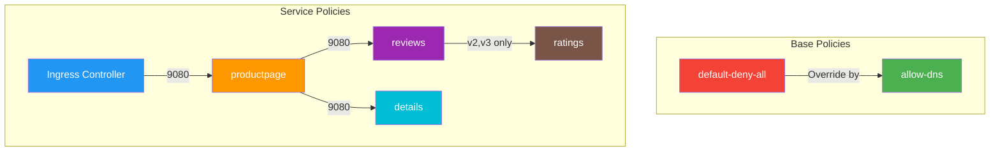

# Bookinfo Network Policies

This directory contains Calico Network Policies for the Bookinfo application, implementing a zero-trust security model.

## Directory Structure

```
.
├── base/
│   ├── 00-default-deny.yaml    # Default deny all traffic
│   └── 01-allow-dns.yaml       # Allow DNS resolution
└── services/
    ├── productpage/
    │   ├── ingress.yaml        # Allow traffic from ingress-nginx
    │   └── egress.yaml         # Allow traffic to reviews and details
    ├── reviews/
    │   ├── ingress.yaml        # Allow traffic from productpage
    │   └── egress.yaml         # Allow v2/v3 traffic to ratings
    ├── details/
    │   └── ingress.yaml        # Allow traffic from productpage
    └── ratings/
        └── ingress.yaml        # Allow traffic from reviews v2/v3
```

## Policy Overview



## Policy Details

### Base Policies

- **default-deny-all**: Implements zero-trust model by denying all traffic by default
- **allow-dns**: Enables DNS resolution for all pods

### Service-specific Policies

#### Productpage Service

- **Ingress**: Allows traffic from ingress-nginx controller
- **Egress**: Permits connections to reviews and details services

#### Reviews Service

- **Ingress**: Accepts traffic from productpage
- **Egress**: Allows v2/v3 versions to connect to ratings service

#### Details Service

- **Ingress**: Accepts traffic from productpage only

#### Ratings Service

- **Ingress**: Accepts traffic from reviews service (v2/v3 only)

## Policy Order

1. Base policies (900-1000)
   - default-deny-all (1000)
   - allow-dns (900)
2. Service policies (100-500)
   - productpage ingress (100)
   - productpage egress (200)
   - reviews/details ingress (300)
   - reviews egress (400)
   - ratings ingress (500)

## setup instruction

### Install calicoctl

#### 替换为你的 Calico 版本（假设当前为 v3.29.2）

CALICO_VERSION="v3.29.2"

##### 下载 calicoctl

curl -L <https://github.com/projectcalico/calico/releases/download/${CALICO_VERSION}/calicoctl-linux-amd64> -o calicoctl

##### 赋予执行权限并移动到 PATH

chmod +x calicoctl
sudo mv calicoctl /usr/local/bin/

calicoctl version

### Configure calicoctl

mkdir -p ~/.kube
cat <<EOF > ~/.kube/calicoctl.cfg
apiVersion: projectcalico.org/v3
kind: CalicoAPIConfig
metadata:
spec:
  datastoreType: "kubernetes"
  kubeconfig: "/home/$(whoami)/.kube/config"  # 必须使用绝对路径
EOF

echo 'export CALICO_CONFIG="$HOME/.kube/calicoctl.cfg"' >> ~/.bashrc
source ~/.bashrc

calicoctl get nodes -o wide

sudo calicoctl node status

calicoctl get networkpolicy -A

## Testing Guide

### 1. Initial Communication Verification

```bash
# Verify all pods are running
kubectl get pods -n dev1

# Access productpage through ingress
curl http://192.168.10.110/productpage

# Test inter-service communication using alpine pod
tc alpine-test 10.96.0.10 53
tc alpine-test 8.8.8.8 53
tc reviews-v2 ratings 9080
tc reviews-v2 productpage 9080
tc productpage reviews  9080
tc productpage details 9080
```

Expected: All services accessible, productpage displays with reviews v1/v2/v3 randomly

### 2. Base Policy Implementation

```bash
# Apply base policies
calicoctl apply -f base/00-default-deny.yaml
tc alpine-test 10.96.0.10 53
calicoctl apply -f base/01-allow-dns.yaml

# Verify DNS works but other traffic blocked
kubectl exec -n dev1 $(kubectl get pod -n dev1 -l app=alpine-test -o name) -- sh -c \
  'nslookup kubernetes.default && curl -v --max-time 5 http://productpage:9080/productpage'
```

Expected:

- DNS resolution succeeds
- curl times out (traffic blocked)
- Web UI inaccessible

### 3. Service Policy Testing

#### a. Productpage Access

```bash
# Apply productpage policies
kubectl apply -f services/productpage/
# Test access via ingress
curl http://192.168.10.110/productpage
```

Expected: Page loads but without reviews/details/ratings

#### b. Reviews Service Access

```bash
# Apply reviews policies
kubectl apply -f services/reviews/
# Verify through Web UI
curl http://192.168.10.110/productpage
```

Expected: Reviews section appears (v1 without stars)

#### c. Details Service Access

```bash
# Apply details policy
kubectl apply -f services/details/
# Verify through Web UI
curl http://192.168.10.110/productpage
```

Expected: Book details appear on the page

#### d. Ratings Service Access

```bash
# Apply ratings policy
kubectl apply -f services/ratings/
# Verify through Web UI by refreshing multiple times
curl http://192.168.10.110/productpage
```

Expected: Black/red stars appear when v2/v3 reviews are shown

### 4. Verification & Troubleshooting

#### Check Policy Status

```bash
# List all network policies
kubectl get networkpolicies.crd.projectcalico.org -n dev1

# View policy details
kubectl get networkpolicy.crd.projectcalico.org <policy-name> -n dev1 -o yaml
```

#### Test Service Isolation

```bash
# Attempt direct access to services from alpine pod
kubectl exec -n dev1 $(kubectl get pod -n dev1 -l app=alpine-test -o name) -- sh -c \
  'curl -v --max-time 5 http://reviews:9080/reviews/1 && \
   curl -v --max-time 5 http://ratings:9080/ratings/1 && \
   curl -v --max-time 5 http://details:9080/details/1'
```

Expected: All requests should timeout (blocked by network policies)

#### Debug Commands

```bash
# Check pod logs
kubectl logs -n dev1 <pod-name>

# Check policy logs (if available)
kubectl logs -n kube-system -l k8s-app=calico-node

# Verify pod labels
kubectl get pods -n dev1 --show-labels
