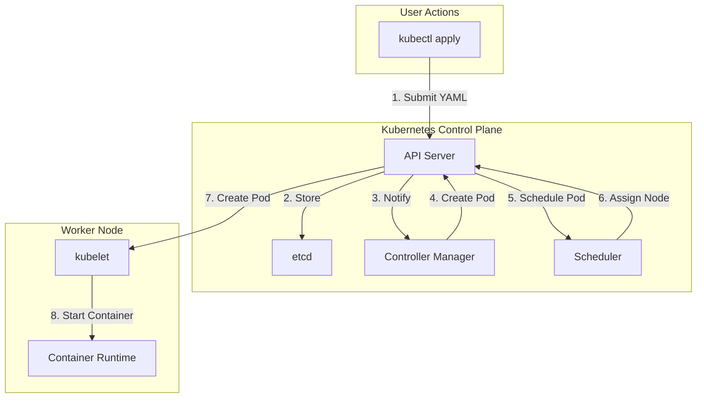

# Application Deployment Flow
This diagram shows how Kubernetes components interact when deploying an application.

Shows the sequence of component interactions when deploying an application, from kubectl command to container creation.
