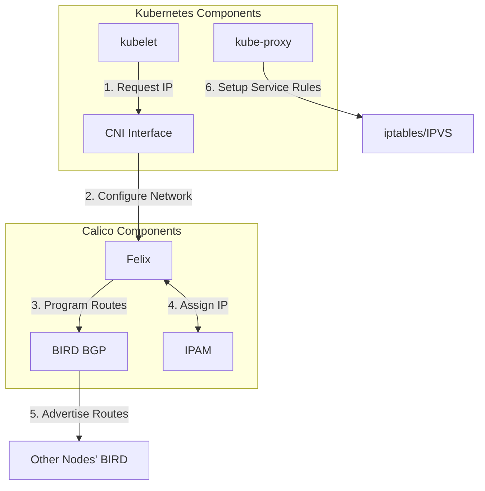

# Pod Networking Flow
This diagram illustrates how Calico and Kubernetes components work together for pod networking.

Illustrates how Calico's CNI plugin, Felix, and BIRD components work with Kubernetes to provide pod networking.
