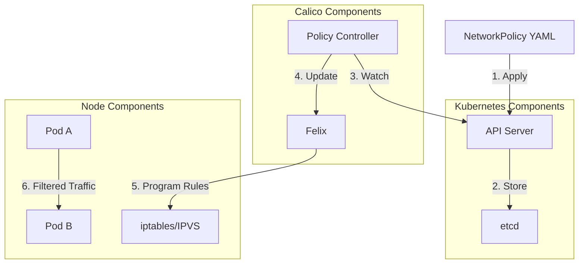

# Security Flow
This diagram shows how Calico and Kubernetes components interact to secure application access.

Demonstrates how NetworkPolicies are implemented through Calico's policy controller and Felix to secure pod-to-pod communication.
