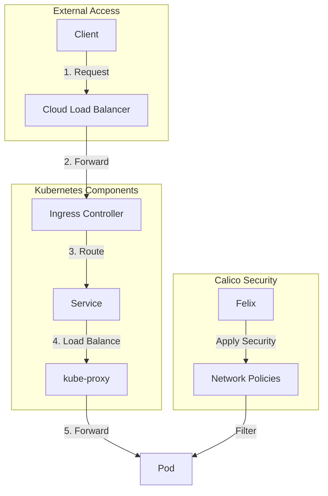

# Application Exposure Flow
This diagram demonstrates how applications are exposed using Calico, Kubernetes, and infrastructure components.

Shows the path of external traffic through load balancers, ingress controllers, and services, with Calico providing security through network policies.
